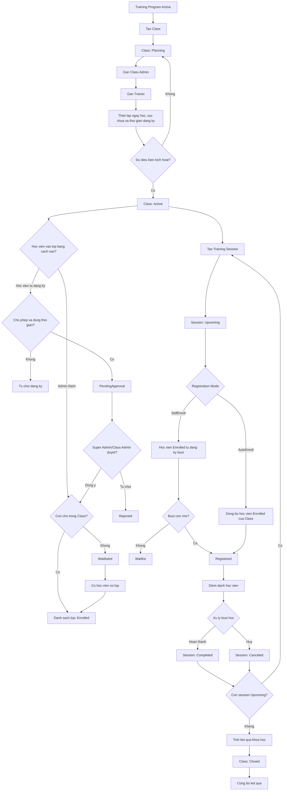
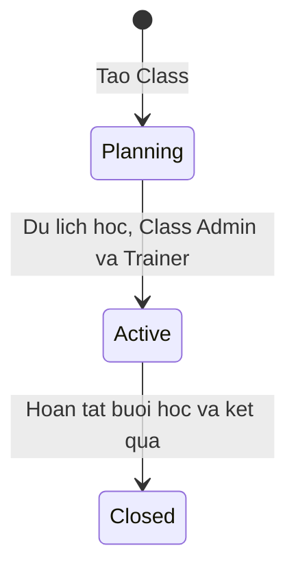
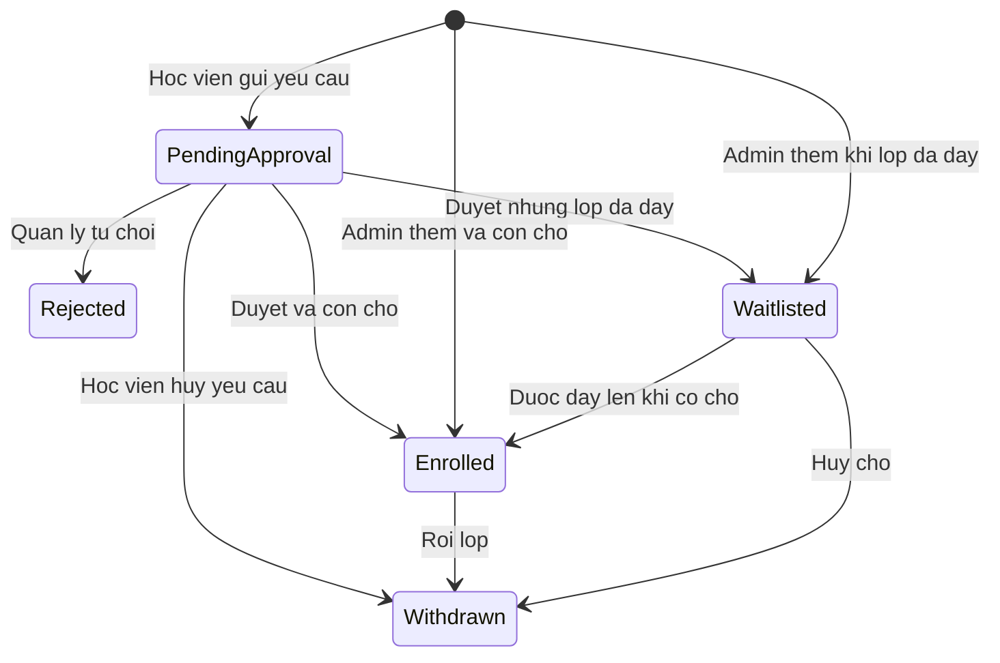
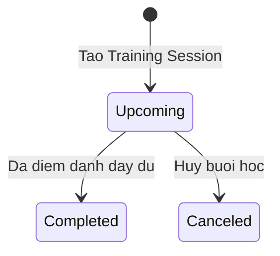

# Workflow Class va Training

Tai lieu nay mo ta luong van hanh hien tai cua hai module:

- `Class`: quan ly lop, nguoi phu trach va danh sach hoc vien chinh thuc.
- `Training`: quan ly tung buoi hoc (`Training Session`), dang ky buoi va diem danh.

`Training Program` la dieu kien dau vao. Mot Class chi duoc tao khi Training Program dang `Active`.

## 1. Workflow tong the



## 2. Workflow module Class

### Vong doi trang thai



Quy tac bat buoc:

1. Class moi luon co trang thai `Planning`.
2. Chi Class `Planning` moi duoc sua thong tin hoac xoa mem.
3. De chuyen `Planning -> Active`, Class phai co:
   - Training Program dang `Active`.
   - `startDate` va `endDate` hop le.
   - It nhat mot Class Admin.
   - It nhat mot Trainer.
4. Chi cho phep `Planning -> Active -> Closed`; khong mo nguoc trang thai.
5. Khi chuyen `Active -> Closed`, he thong phai tinh va chot ket qua khoa hoc.

### Luong quan ly hoc vien cua Class



- Admin co the them hoc vien khi Class dang `Planning` hoac `Active`.
- Hoc vien chi duoc gui yeu cau khi Class `Active`, `selfEnrollmentEnabled = true` va nam trong khoang ngay dang ky.
- Yeu cau tu dang ky co trang thai `PendingApproval`; chua co quyen vao lop, tai lieu, quiz hay buoi hoc.
- Super Admin hoac Class Admin duoc phan cong duyet yeu cau. Neu con cho thi thanh `Enrolled`, neu het cho thi thanh `Waitlisted`.
- Quan ly co the tu choi thanh `Rejected`; hoc vien co the gui lai khi lop van dang mo dang ky.
- User phai dang `Active` va co role `Trainee`.
- Khi het cho, he thong chuyen hoc vien vao `Waitlisted`.
- Khi mot hoc vien `Enrolled` roi lop, nguoi cho som nhat duoc chuyen thanh `Enrolled`.
- Roi lop khong xoa lich su. He thong chi huy cac dang ky buoi hoc trong tuong lai.
- Enum co trang thai `Completed`, nhung luong dong Class hien tai chot ket qua trong `course_results`; no khong tu dong doi tat ca enrollment sang `Completed`.

### API Class theo thu tu thao tac

| Buoc | API | Muc dich |
|---:|---|---|
| 1 | `POST /api/v1/classes` | Tao Class o trang thai `Planning` |
| 2 | `PUT /api/v1/classes/{id}/admins` | Gan Class Admin |
| 3 | `PUT /api/v1/classes/{id}/trainers` | Gan Trainer |
| 4 | `PUT /api/v1/classes/{id}` | Chinh lich, suc chua va cau hinh dang ky |
| 5 | `POST /api/v1/classes/{id}/enrollments` | Admin them mot hoac nhieu Trainee |
| 6 | `PATCH /api/v1/classes/{id}/status` | Chuyen sang `Active` |
| 7 | `GET /api/v1/classes/{id}/enrollments` | Xem danh sach, bao gom yeu cau `PendingApproval` |
| 8 | `PATCH /api/v1/classes/{id}/enrollments/{userId}/approve` | Duyet yeu cau tu dang ky |
| 9 | `PATCH /api/v1/classes/{id}/enrollments/{userId}/reject` | Tu choi yeu cau tu dang ky |
| 10 | `DELETE /api/v1/classes/{id}/enrollments/{userId}` | Cho hoc vien roi lop, giu lich su |
| 11 | `PATCH /api/v1/classes/{id}/status` | Chuyen `Active -> Closed` |

API cho Trainee:

| API | Muc dich |
|---|---|
| `GET /api/v1/me/available-classes` | Xem cac lop dang mo tu dang ky |
| `GET /api/v1/me/class-enrollments` | Xem lich su lop cua ban than |
| `POST /api/v1/classes/{id}/enrollments/me` | Gui yeu cau dang ky lop va cho duyet |
| `DELETE /api/v1/classes/{id}/enrollments/me` | Huy yeu cau, roi lop hoac huy cho |

## 3. Workflow module Training

Moi Training Session thuoc mot Class `Active` va su dung Trainer da duoc gan vao Class.

### Vong doi trang thai



He thong hien khong co trang thai `Ongoing`.

Quy tac bat buoc:

1. Session moi luon co trang thai `Upcoming`.
2. Chi Session `Upcoming` moi duoc sua.
3. Ngay cua Session phai nam trong khoang ngay cua Class.
4. Trainer phai duoc gan vao Class.
5. Khong duoc trung lich Class, Trainer hoac phong hoc.
6. Suc chua moi khong duoc nho hon so hoc vien da dang ky.
7. `Upcoming -> Completed` chi hop le khi moi hoc vien `Registered` da co diem danh.
8. `Upcoming -> Canceled` se doi `Registered` va `Waitlist` thanh `Cancelled`, dua `enrolledCount` ve 0 va gui thong bao.
9. Khong the dua `Completed` hoac `Canceled` tro lai `Upcoming`.

### Hai che do dang ky buoi hoc

| Che do | Cach hoat dong | Quy tac quan trong |
|---|---|---|
| `AutoEnroll` | Tu dong lay tat ca hoc vien `Enrolled` cua Class | Suc chua Session phai lon hon hoac bang suc chua Class; hoc vien khong tu huy tung buoi, muon huy phai roi Class |
| `SelfEnroll` | Hoc vien tu chon buoi muon tham gia | Chi Trainee dang `Enrolled` trong Class moi dang ky duoc; het cho thi vao `Waitlist` |

### API Training theo thu tu thao tac

| Buoc | API | Muc dich |
|---:|---|---|
| 1 | `POST /api/v1/training-sessions` | Tao Session `Upcoming` |
| 2 | `GET /api/v1/training-sessions?classId={id}` | Xem cac Session cua Class |
| 3 | `PUT /api/v1/training-sessions/{id}` | Sua Session khi con `Upcoming` |
| 4 | `POST /api/v1/training-sessions/{id}/registrations` | Trainee dang ky Session `SelfEnroll` |
| 5 | `GET /api/v1/training-sessions/{id}/participants` | Xem Registered/Waitlist/Completed |
| 6 | `POST /api/v1/training-sessions/{id}/check-in` | Trainee tu check-in |
| 7 | `PUT /api/v1/training-sessions/{id}/attendance` | Nguoi quan ly nhap/cap nhat diem danh |
| 8 | `PATCH /api/v1/training-sessions/{id}/status` | Chuyen sang `Completed` hoac `Canceled` |
| 9 | `DELETE /api/v1/training-sessions/{id}/registrations/me` | Trainee huy dang ky Session `SelfEnroll` |

## 4. Phan quyen de theo workflow

| Vai tro | Class | Training Session |
|---|---|---|
| Super Admin | Xem va quan ly tat ca Class, hoc vien, cau hinh ket qua | Xem va quan ly tat ca Session |
| Class Admin | Quan ly Class duoc phan cong va danh sach hoc vien | Tao, sua, diem danh va ket thuc Session cua Class duoc phan cong |
| Trainer | Xem Class duoc phan cong; theo nghiep vu nen chi xem danh sach hoc vien | Tao Session cho chinh minh neu duoc gan; quan ly Session do minh day |
| Trainee | Tu dang ky/roi lop va xem lop cua minh | Dang ky buoi `SelfEnroll`, check-in va xem buoi cua minh |

Trainer chi duoc xem danh sach hoc vien. API them, duyet, tu choi va cho hoc vien roi lop chi cho Super Admin hoac Class Admin duoc phan cong.

## 5. Checklist van hanh mot Class hoan chinh

### Giai doan chuan bi

- [ ] Training Program dang `Active`.
- [ ] Tao Class va nhan trang thai `Planning`.
- [ ] Dien ngay bat dau, ngay ket thuc va suc chua.
- [ ] Cau hinh cho phep tu dang ky va khoang ngay dang ky.
- [ ] Gan it nhat mot Class Admin.
- [ ] Gan it nhat mot Trainer.
- [ ] Them hoc vien truoc neu can.
- [ ] Chuyen Class sang `Active`.

### Giai doan dao tao

- [ ] Tao cac Session trong khoang ngay cua Class.
- [ ] Chon ro `AutoEnroll` hoac `SelfEnroll` cho tung Session.
- [ ] Kiem tra danh sach `Registered` va `Waitlist`.
- [ ] Thuc hien check-in hoac nhap diem danh.
- [ ] Complete Session khi tat ca hoc vien Registered da co diem danh.
- [ ] Neu huy Session, kiem tra dang ky da thanh `Cancelled` va thong bao da duoc tao.

### Giai doan ket thuc

- [ ] Co it nhat mot Session `Completed`.
- [ ] Khong con Session `Upcoming`; cac buoi phai `Completed` hoac `Canceled`.
- [ ] Cac quiz bat buoc da `Closed`.
- [ ] Ket qua moi hoc vien khong con `InProgress`.
- [ ] Chuyen Class `Active -> Closed`.
- [ ] Cong bo ket qua cho hoc vien.

## 6. Cac loi thuong gap khi di sai workflow

| Ma loi | Nguyen nhan chinh |
|---|---|
| `CLASS_TRAINING_PROGRAM_NOT_ACTIVE` | Training Program chua Active |
| `CLASS_ADMIN_REQUIRED` | Chua gan Class Admin truoc khi Active |
| `CLASS_TRAINER_REQUIRED` | Chua gan Trainer truoc khi Active |
| `CLASS_NOT_OPEN_FOR_ENROLLMENT` | Trainee tu dang ky khi Class chua Active |
| `CLASS_SELF_ENROLLMENT_DISABLED` | Class chua bat tu dang ky |
| `CLASS_ENROLLMENT_REQUIRED` | Dang ky Session SelfEnroll khi chua Enrolled trong Class |
| `AUTO_ENROLL_SESSION_CAPACITY_TOO_SMALL` | Suc chua Session nho hon suc chua Class |
| `TRAINING_SESSION_ATTENDANCE_REQUIRED` | Complete Session khi chua diem danh du |
| `CLASS_SESSIONS_INCOMPLETE` | Dong Class khi van con Session Upcoming |
| `REQUIRED_QUIZ_NOT_CLOSED` | Dong Class khi quiz bat buoc chua Closed |

## 7. Thu tu ngan gon de ghi nho

```text
Program Active
-> Class Planning
-> Gan Admin + Trainer
-> Cau hinh Class
-> Class Active
-> Hoc vien gui yeu cau va quan ly duyet
-> Enroll hoc vien
-> Tao Session
-> Dang ky/AutoEnroll
-> Diem danh
-> Session Completed hoac Canceled
-> Tinh ket qua
-> Class Closed
-> Cong bo ket qua
```
